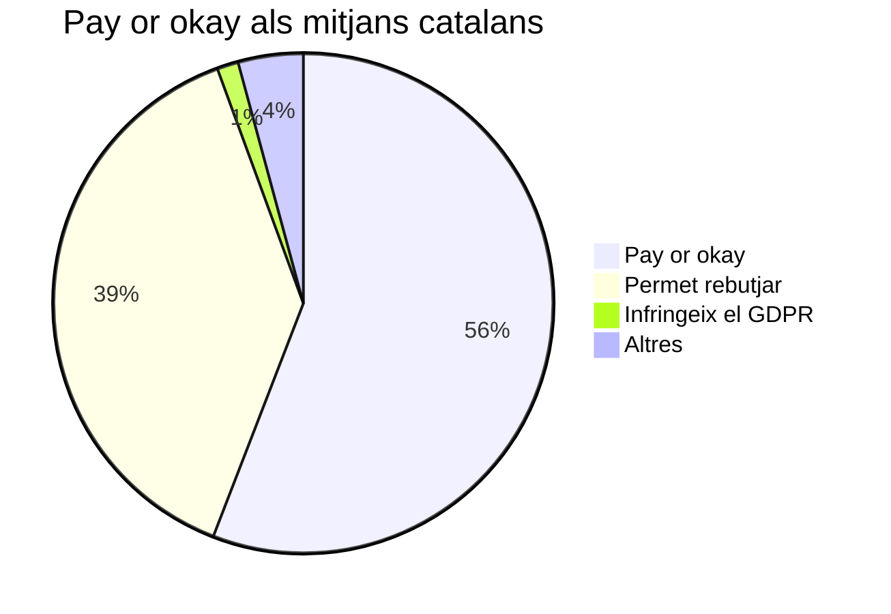

El gener de 2024 la premsa espanyola va afegir, coordinadament i per sorpresa, un mur de cookies que passava a demanar als lectors un pagament a canvi de preservar les dades personals, el que es coneix com "pay or okay" (paga o accepta-ho). En aquesta crònica intento reunir les causes d'aquest canvi, la relació amb el Reglament Europeu de Protecció de Dades, i per què les institucions europees neguen a alguns serveis com Meta aquesta pràctica mentre ho permeten a la premsa.

<!-- omit from toc -->
## Continguts

[[toc]]

## Cronologia

| Data | Esdeveniment |
| ---- | ------------ |
| Març de 2016 | L'Autoritat Federal de Defensa de la Competència d'Alemanya obre una investigació a Facebook.[^Bundeskartellamt] |
| 6 de febrer de 2019 | L'Autoritat Federal de Defensa de la Competència d'Alemanya ordena a Meta que faci modificacions en els termes del servei i en la recollida de dades.[^Bundeskartellamt] |
| 11 de febrer de 2019 | Meta impugna la decisió de l'autoritat alemanya davant el Tribunal Superior Regional del Civil i el Penal de Düsseldorf.[^TJUE] |
| 9 d'agost de 2021 | El Tribunal Superior de Düsseldorf eleva al Tribunal de Justícia de la Unió Europea set qüestions prejudicials sobre el cas _Meta contra Bundeskartellamt_.[^TJUE] |
| 22 de març de 2023 | La Conferència de Protecció de Dades d'Alemanya permet el "pay or okay".[^DSK] |
| 4 de juliol de 2023 | La sentència del TJUE inclou una valoració que obre la porta al "pay or okay".[^TJUE] |
| 11 de juliol de 2023 | L'AEPD actualitza la Guia de cookies permetent el "pay or okay".[^AEPD23] |
| 30 d'octubre de 2023 | Meta anuncia una subscripció de pagament sense anuncis.[^Meta] |
| 12 de gener de 2024 | La premsa espanyola posa em marxa un mur de pagament de manera coordinada.[^324] [^ElPeriodico] [^ElCorreo] |
| 17 d'abril de 2024 | El CEPD publica el dictamen 8/2024 sobre "pay or okay".[^CEPD-08/2024] |
| 14 de maig de 2024 | L'AEPD actualitza la Guia de cookies mencionant el dictamen 8/2024 del CEPD, però sense modificar el criteri sobre "pay or okay". |

## El cas Meta contra Bundeskartellamt

El març de 2016 l'Autoritat Federal de Defensa de la Competència d'Alemanya, o Bundeskartellamt, va iniciar una investigació sobre la recopilació i ús de les dades privades que Facebook estava fent a Europa.[^Bundeskartellamt] El que preocupava al Bundeskartellamt, que no és una agència de protecció de dades sinó de defensa de la competència, era que Facebook també és propietari d'Instagram i WhatsApp, el que el converteix en una empresa dominant en el mercat de les xarxes socials. Aquesta posició dominant era aprofitada per combinar les dades personals dels comptes dels diferents serveis com si es tractessin d'un sol compte unificat.

> Obtenim informació seva de les empreses que són propietat de Facebook o que són operades per Facebook, d'acord amb les seves condicions i polítiques.
> --- Política de privacitat de Facebook (2016)[^FacebookPrivacy2016]

Facebook va incloure aquest ús de les dades de l'usuari en les condicions d'ús del servei, de manera que les alternatives que s'oferien als usuaris eren: o bé cedir les dades, o bé quedar-se sense accés a Facebook, WhatsApp i Instagram. La quota de mercat combinada d'aquests serveis suposava el 90% del mercat alemany[^Bundeskartellamt], convertint aquesta elecció en impossible a ulls del Bundeskartellamt.

Tres anys més tard, el 6 de febrer de 2019, el Bundeskartellamt va publicar les conclusions del cas B6-22/16[^Bundeskartellamt] i va ordenar a Facebook, aleshores ja Meta, que aturés aquestes pràctiques. A més, el Reglament General de Protecció de Dades (RGPD) feia un any que havia entrat en vigor, augmentant la base legal de l'informe.

Aquesta investigació a Alemanya no és un cas aïllat, ja que processos similars es van produir a altres estats. El que la fa interessant és que cinc dies més tard Meta va impugnar l'ordre del Bundeskartellamt davant del Tribunal Superior de Düsseldorf. Mentre jutjava el recurs de Meta, el 9 d'agost de 2021 aquest tribunal alemany va elevar una sèrie de qüestions prejudicials al Tribunal de Justícia de la Unió Europea (TJUE).

## El TJUE obre la veda

El 4 de juliol de 2023, un any i mig més tard del requeriment del tribunal alemany i set anys més tard de l'inici de la investigació a Facebook, el TJUE va dictar sentència[^TJUE] donant la raó en la majoria de les qüestions prejudicials al Bundeskartellamt. En resum, el TJUE assenta en jurisprudència la interpretació del Bundeskartellamt en considerar que Meta no pot condicionar l'accés o la qualitat del servei a l'acceptació del tractament de les dades personals.

Però el que fa especial aquesta sentència és el redactat del paràgraf 150 (èmfasi meu):

> Així doncs, en el marc del procés contractual, aquests usuaris han de tenir la llibertat de negar-se individualment a prestar el seu consentiment per a operacions específiques de tractament de dades que no siguin necessàries per a l'execució del contracte, sense que per això es vegin obligats a renunciar completament a l'ús del servei ofert per l'operador de la xarxa social en línia. Això implica que se'ls ofereixi una alternativa equivalent no acompanyada d'aquestes operacions de tractament de dades, **si escau, a canvi d'una remuneració adequada.**[^TJUE]

Aquest afegitó al final del paràgraf posa per escrit que el "pay or okay" és un model compatible amb el RGPD, deslligant l'obligació de pagar de la consideració de "lliure consentiment". Si et sembla que amb aquest petit gest el tribunal dinamita les bases del RGPD, no ets l'únic[^NOYB-obiter-dictum]. Les més de 18.000 paraules de la sentència del TJUE tancaven la porta al model de 2016 de Meta, però una simple frase obria una finestra al "pay or okay" que Meta ràpidament va posar en pràctica tres mesos després:

> L'opció que les persones comprin una subscripció sense anuncis equilibra els requisits dels reguladors europeus mentre ofereix als usuaris una elecció i permet que Meta continuï donant servei a totes les persones a la UE, l'EEE i Suïssa. En la seva sentència, el TJUE va reconèixer expressament que un model de subscripció, com el que estem anunciant, és una forma vàlida de consentiment per a un servei finançat per anuncis.[^Meta]

Per què el TJUE va reconèixer la validesa del "pay or okay" en una sentència? Al cap i a la fi, l'opció de pagament no formava part del litigi entre Meta i el Bundeskartellamt, ni formava part de les set qüestions prejudicials que el Tribunal Superior de Düsseldorf va elevar al TJUE. Aquest [_obiter dictum_](https://ca.wikipedia.org/wiki/Obiter_dictum) era una ocurrència del tribunal europeu o tenia algun altre origen?

## Els orígens del "pay or okay"

El diari austríac Der Standard va ser dels primers a veure que el RGPD no prohibia expressament que l'opció sense cookies de la web fos de pagament. Quan les autoritats de protecció de dades d'Àustria[^DSB-DerStandard] [^NOYB-DerStandard], Alemanya[^LFD] i França[^CNIL] van permetre aquesta pràctica, es va estendre ràpidament a altres mitjans[^NOYB-PayOrOkay] [^NOYB-obiter-dictum].

És possible que aquesta doctrina hagi inspirat aquest fragment de la sentència del TJUE, que tot i que jurídicament potser no es pot considerar jurisprudència sí que té un efecte molt persuasiu quant a inspirar i coordinar les polítiques dels estats comunitaris.

## Amb la benedicció de l'AEPD

L'11 de juliol de 2023, tan sols set dies després que el TJUE publiqués la sentència, l'AEPD va publicar una nova versió de la "Guía sobre el uso de cookies"[^AEPD23], afegint el següent fragment (èmfasi meu):

> Podran existir determinats supòsits en els quals la no acceptació de la utilització de cookies impedeixi l'accés al lloc web o la utilització total o parcial del servei, sempre que s'informi adequadament al respecte a l'usuari i s'ofereixi una alternativa, **no necessàriament gratuïta,** d'accés al servei sense necessitat d'acceptar l'ús de cookies.[^AEPD-GuiaCookies]

En la notícia que anunciava aquest canvi, l'AEPD diu que s'ha adaptat la guia a la nova directiva 03/2022 del Comitè Europeu de Protecció de Dades, i breument i sense més explicació, que "la nova versió de la Guia aclareix que aquesta alternativa \[sense cookies\] no haurà de ser necessàriament gratuïta". No cal dir que la directiva 03/2022 no esmenta en cap moment res sobre alternatives de pagament,[^CEPD-03/2022] ni l'AEPD justifica aquest canvi que possiblement prové de la sentència del TJUE.

La notícia també diu que:

> Els nous criteris s'hauran d'implementar, a tot tardar, l'11 de gener de 2024, establint així un període transitori de sis mesos per a l'adaptació.[^AEPD23]

I justament, la premsa espanyola de manera coordinada va implementar murs de pagament exactament sis mesos després que es publiqués aquest canvi a la guia. Tot i ser un canvi radical, molt pocs mitjans en parlen, i pràcticament cap ho critica. Totes les notícies[^324] [^ElPeriodico] [^ElCorreo] es fan eco de l'explicació de l'AEPD a la seva notícia de l'11 de juliol de 2023, dient que els murs de pagament es deuen a l'adaptació a les directrius del CEPD. Com hem vist, ni la directiva 03/2022 diu res sobre murs de pagament, ni el CEPD ho havia discutit. Encara.

El Periódico va més lluny[^ElPeriodico] i entra en una diatriba sobre Google i la iniciativa _Privacy Sandbox_[^PrivacySandbox]. Per no desviar-nos molt del tema, l'objectiu de Google era modificar els estàndards d'Internet perquè els navegadors ~~espiïn~~ creïn un perfil d'interessos del mateix usuari i n'informin a les webs a cada visita. Això permetria eliminar les cookies de seguiment, tot traslladant el camp de batalla a un nou escenari. Les organitzacions que defensen els drets dels usuaris ja van posar el crit al cel[^EFF-PrivacySandbox]. Tornant al que ens ocupa, El Periódico deia "el passat 4 de gener, Google va començar a eliminar les cookies de tercers", fet que als seus ulls justifica que la premsa espanyola _ensemble_ cobri als usuaris si no volen cedir les seves dades personals. Uns mesos més tard, Google va fer marxa enrere i va descartar bloquejar les cookies de seguiment[^Google-Cookies]. Per tant, ara continuem tenint cookies de seguiment _i alhora_ murs de pagament.

La clara coordinació de la premsa espanyola (amb honroses excepcions) per establir murs de pagament, queixant-se que sense el tràfic de les dades personals dels usuaris el seu negoci no és viable, és un bany de realitat. Qui denunciarà el tràfic massiu de dades privades quan els mitjans de comunicació participen activament en l'erosió del RGPD? L'OCU feia una crítica molt ambigua a aquests murs de pagament, dient els usuaris no haurien de pagar per la seva privacitat, però alhora que cal valorar si el preu és just i proporcional[^OCU]. Xnet va signar la carta que 28 organitzacions europees van enviar el febrer de 2024 al CEPD[^NOYB-NGOS] en contra del model "pay or okay" de Meta, però no he trobat que fessin cap comunicat sobre la mateixa pràctica que apliquen aquí els mitjans de comunicació.

L'actuació de l'AEPD, a diferència de la d'altres autoritats europees, és més favorable al "pay or okay" i, per tant, actua per aprofundir aquesta escletxa en el RGPD en lloc de tancar-la.

## El Comitè Europeu de Protecció de Dades reacciona

Mentre a l'AEPD i els mitjans espanyols s'apuntaven cinc anys més tard al "pay or okay", a Europa la batalla contra aquest model es va concentrar en Meta, que l'havia adoptat després del revés jurídic del TJUE a Alemanya. El 26 de gener de 2024, les autoritats de protecció de dades de Països Baixos, Noruega i de l'estat d'Hamburg van demanar al CEPD que dictaminés si el model de "pay or okay" de les grans plataformes (llegir Meta) vulnerava la condició de "lliure consentiment" requerida pel RGPD[^EDPB-DPAS]. Unes setmanes més tard, 28 organitzacions de defensa del dret a la privacitat van enviar una carta al CEPD per expressar la seva opinió sobre aquest afer[^NOYB-NGOS].

Finalment, el 16 d'abril de 2024 el CEPD va publicar el dictamen 08/2024[^CEPD-08/2024] que avalua si exigir als usuaris que consentin el seguiment publicitari o paguin per una versió sense anuncis d'un servei constitueix un consentiment vàlid segons el RGPD. En primer lloc, el text reiteradament aclareix que només fa referència a les "grans plataformes". Llavors passa a considerar que el model de "pay or okay" sovint no compleix el requisit de "lliure consentiment" exigit pel RGPD a causa dels desequilibris de poder i la manca d'alternatives reals, especialment quan els usuaris depenen del servei. La decisió subratlla que les plataformes haurien d'oferir una alternativa realment equivalent sense seguiment, i que el fet de proporcionar només una opció de pagament no justifica automàticament el consentiment. Tot i que el model "pay or okay" no està totalment prohibit, el CEPD adverteix que la majoria d'implementacions d'aquest sistema per part de grans plataformes probablement no compleixen el RGPD.

## Les contradiccions inherents del "pay or okay"

El concepte de "grans plataformes" no és una categoria del RGPD, però el CEPD aplica una supervisió més estricta a serveis digitals dominants on l'elecció de l'usuari és limitada. Tot i ser difícil d'assegurar, podria ser un equilibri que fa el CEPD per mantenir la integritat del RGPD sense prohibir directament el "pay or okay", establint uns requisits més específics que els que va determinar el TJUE el 2023. El que podria significar per la doctrina del "pay or okay" és que es consideraria contrari al "lliure consentiment" del RGPD si, a la pràctica, l'usuari no té cap alternativa en termes de mercat. Això es donaria en casos com el de Meta, que té consideració de "plataforma molt gran" segons la recent Llei de Serveis Digitals de la Unió Europea (DSA, en anglès), però obre la porta al fet que el "pay or okay" sigui legítim per a plataformes petites.

El 14 de maig de 2024 l'AEPD va recollir els canvis a la seva guia amb una pàgina més on alertava del nou dictamen, fent especial èmfasi que es referia únicament a "grans plataformes". Així, la premsa espanyola és una més de les que se suma al "pay or okay" juntament amb Àustria[^DSB-DerStandard] [^NOYB-DerStandard], Alemanya[^LFD] França[^CNIL] o el Regne Unit[^UK-pay1] [^UK-pay2]. Es tracta, per tant, de l'atac més exitós fins ara al RGPD.

Encara no és clar quin serà el resultat, però podem avançar què passaria si es permet el model de "pay or okay" per a plataformes petites, com s'està observant en els països on ja s'ha implementat. Recordem que el RGPD estableix clarament que sempre hi ha d'haver una alternativa a l'ús de dades personals per a finalitats no essencials, com la publicitat. La teoria del "pay or consent" és que aquesta alternativa no necessàriament ha de ser gratuïta, amb la condició que existeixin en el mercat alternatives que sí que ho siguin. Per tant, Meta, en la seva condició de "plataforma molt gran", a la pràctica imposa el "pay or okay". En canvi, un mitjà de comunicació sí que ho pot fer, ja que l'usuari sempre pot consultar un altre mitjà de la competència.

Però, com hem vist, què passa quan la majoria dels mitjans apliquen la mateixa pràctica de manera coordinada? En el cas de la premsa espanyola, a la pràctica podria tenir el mateix efecte que el d'una "gran plataforma digital". Per comprovar aquesta hipòtesi, a tall d'estudi podem agafar els mitjans catalans. La DSA defineix com a "plataforma molt gran" aquells serveis que tenen més de 45 milions d'usuaris a la Unió Europea[^DSA]. Com que la població de la Unió Europea és de 449 milions de persones, la definició de la DSA s'aplicaria a tot servei que tingui com a usuaris el 10% de la població o més.

Després de revisar les dades de lectors en línia dels mitjans catalans publicades per OJD el gener de 2025, he estimat que com a mínim un 56% d'usuaris inclosos en l'estudi són a mitjans que apliquen el "pay or okay":

Per tant ens trobem que només a Catalunya la pràctica del "pay or okay", si es considera agregada, supera de sobres la consideració de "plataforma molt gran".

Dit això, cal fer algunes consideracions sobre aquest petit estudi. Primer, que la proporció que he aplicat per estimar el que seria una "plataforma molt gran" a Catalunya és una simplificació, ja que no es pot extrapolar una relació directa entre població i usuaris, o tan sols entre usuaris i persones. A més, la consideració de "plataforma molt gran" va més enllà de la quota en un sol mercat, pel fet que Meta o Google transvasen les dades d'un servei cap a un altre per obtenir avantatge competitiu. Segon, que l'estudi d'audiència d'OJD no inclou des de fa anys alguns dels mitjans més grans, com El Nacional o Nació Digital, i per tant el percentatge real de mercat que aplica el "pay or okay" és probablement molt més alt del 56%, potser acostant-se al 70% o 80%. Però crec que les dades que s'obtenen indiquen una tendència molt clara, a pesar d'aquestes consideracions.

Podem dir, en conseqüència, que els usuaris a Catalunya tenim una alternativa real per consultar l'actualitat sense pagar o regalar les nostres dades personals?

En últim lloc, cal parlar de si el "pay or okay" ofereix una alternativa real als usuaris. Com indica NOYB[^NOYB-Opinion-payokay], el "pay or okay" fa que els usuaris que accepten les cookies passi del 3% al 99,9%. Es pot considerar encara una decisió consentida i lliure? I si els usuaris decideixen pagar per evitar les cookies, de quines quantitats estem parlant? Segons NOYB[^NOYB-preu], el cost de les subscripcions als principals serveis d'Espanya per evitar les cookies podria suposar, de mitjana, uns 121 € al mes, o 1460 € a l'any.

La meva conclusió és que la distinció basada en la definició de "plataformes molt grans" de la DSA provoca un efecte oligopoli, el qual priva als usuaris d'una alternativa real. Permetre aquesta pràctica suposaria un cop mortal al RGPD. Per contra, prohibir-la tancaria aquesta escletxa i faria que la indústria de la publicitat es plantegés un cop més abandonar el tràfic de dades personals.

## Referències

[^AEPD23]: _La AEPD actualiza su Guía sobre el uso de cookies para adaptarla a las nuevas directrices del Comité Europeo de Protección de Datos,_ AEPD, 11 de juliol de 2023 ([en línia](https://www.aepd.es/prensa-y-comunicacion/notas-de-prensa/aepd-actualiza-guia-cookies-para-adaptarla-a-nuevas-directrices-cepd)).
[^AEPD-GuiaCookies]: _Guía sobre el uso de las cookies,_ AEPD, 2023 ([arxivat](http://web.archive.org/web/20240117031559/https://www.aepd.es/guias/guia-cookies.pdf)).
[^DSK]: _Bewertung von Pur-Abo-Modellen auf Websites,_ DSK, març de 2023 ([en línia](https://www.datenschutzkonferenz-online.de/media/pm/DSK_Beschluss_Bewertung_von_Pur-Abo-Modellen_auf_Websites.pdf)).
[^TJUE]: _Sentencia del Tribunal de Justicia (Gran Sala) de 4 de julio de 2023. Meta Platforms Inc. y otros contra Bundeskartellamt,_ TJUE, juliol de 2023 ([en línia](https://eur-lex.europa.eu/legal-content/ES/TXT/?uri=CELEX:62021CJ0252)).
[^324]: _És legal fer pagar si no s'accepten les cookies? El canvi que indigna els usuaris,_ 324, febrer de 2024 ([en línia](https://www.3cat.cat/324/es-legal-fer-pagar-si-no-saccepten-les-cookies-el-canvi-que-indigna-els-usuaris/noticia/3277188/)).
[^ElPeriodico]: _Los medios de comunicación españoles ya cobran a los usuarios que no acepten las cookies de rastreo,_ El Periódico, gener de 2024 ([en línia](https://www.elperiodico.com/es/tecnologia/20240112/medios-comunicacion-espana-cobrar-usuarios-cookies-periodismo-pago-96811867)).
[^ElCorreo]: _Por qué pedimos la aceptación de las 'cookies',_ El Correo, gener de 2024 ([en línia](https://www.elcorreo.com/tecnologia/pedimos-aceptacion-cookies-20240111070603-ntrc.html)).
[^Meta]: _Facebook and Instagram to Offer Subscription for No Ads in Europe,_ Meta, octubre de 2023 ([en línia](https://about.fb.com/news/2024/11/facebook-and-instagram-to-offer-subscription-for-no-ads-in-europe/)).
[^CEPD-08/2024]: _Dictamen 8/2024 sobre el consentimiento válido en el contexto de los modelos de consentimiento o pago aplicados por las plataformas en línea de gran tamaño,_ CEPD, abril de 2024 ([en línia](https://www.edpb.europa.eu/our-work-tools/our-documents/opinion-board-art-64/opinion-082024-valid-consent-context-consent-or_es)).
[^Bundeskartellamt]: _B6-22/16. Facebook, Exploitative business terms pursuant to Section 19(1) GWB for inadequate data processing,_ Bundeskartellamt, 15 de febrer de 2019 ([en línia](https://www.bundeskartellamt.de/SharedDocs/Entscheidung/EN/Fallberichte/Missbrauchsaufsicht/2019/B6-22-16.pdf)).
[^FacebookPrivacy2016]: _Data Policy,_ Facebook, 2016 ([arxivat](https://web.archive.org/web/20160316124448/https://www.facebook.com/about/privacy)).
[^NOYB-obiter-dictum]: _Meta (Facebook / Instagram) to move to a "Pay for your Rights" approach,_ NOYB, 2023 ([en línia](https://noyb.eu/en/meta-facebook-instagram-move-pay-your-rights-approach)).
[^NOYB-DerStandard]: _“Pay or Okay” bei derStandard.at?,_ NOYB, 2018 ([en línia](https://noyb.eu/en/pay-or-okay-bei-derstandardat)).
[^DSB-DerStandard]: _Lukas A. vs Standard Verlagsgesellschaft m. b. H.,_ DSB, 2018 ([en línia](https://www.ris.bka.gv.at/Dokumente/Dsk/DSBT_20181130_DSB_D122_931_0003_DSB_2018_00/DSBT_20181130_DSB_D122_931_0003_DSB_2018_00.pdf)).
[^NOYB-PayOrOkay]: _News Sites: Readers need to "buy back" their own data at an exorbitant price?!,_ NOYB, 2021 ([en línia](https://noyb.eu/en/news-sites-readers-need-buy-back-their-own-data-exorbitant-price)).
[^CEPD-03/2022]: _Guidelines 03/2022 on deceptive design patterns in social media platform interfaces,_ CEPD, febrer de 2023 ([en línia](https://www.edpb.europa.eu/our-work-tools/our-documents/guidelines/guidelines-032022-deceptive-design-patterns-social-media_en)).
[^PrivacySandbox]: _Privacy Sandbox,_ Wikipedia ([en línia](https://en.wikipedia.org/wiki/Privacy_Sandbox)).
[^EFF-PrivacySandbox]: _Don't Play in Google's Privacy Sandbox,_ EFF, 30 d'agost de 2019 ([en línia](https://www.eff.org/deeplinks/2019/08/dont-play-googles-privacy-sandbox-1)).
[^Google-Cookies]: _A new path for Privacy Sandbox on the web,_ Google, 22 de juliol de 2024 ([en línia](https://privacysandbox.com/intl/en_us/news/privacy-sandbox-update/)).
[^OCU]: _Rechazar cookies, todo un lujo,_ OCU, 26 de gener de 2024 ([en línia](https://www.ocu.org/consumo-familia/derechos-consumidor/informe/cookies-pago-rechazo)).
[^NOYB-NGOS]: _28 NGOs urge EU DPAs to reject “Pay or Okay” on Meta,_ NOYB, 16 de febrer de 2024 ([en línia](https://noyb.eu/en/28-ngos-urge-eu-dpas-reject-pay-or-okay-meta)).
[^EDPB-DPAS]: _Request for an EDPB opinion on “consent or pay”,_ Datatilsynet, 26 de gener de 2024 ([en línia](https://www.datatilsynet.no/en/news/aktuelle-nyheter-2024/request-for-an-edpb-opinion-on-consent-or-pay/)).
[^UK-pay1]: _‘Consent or pay’: Why UK news websites are getting tough with readers over data,_ PressGazette, 12 de setembre de 2024 ([en línia](https://pressgazette.co.uk/marketing/consent-or-pay-news-websites-uk/)).
[^UK-pay2]: _Guardian, GB News and Newsquest among latest publishers to tell readers: ‘consent or pay’,_ PressGazette, 14 de març de 2025 ([en línia](https://pressgazette.co.uk/marketing/cookies-consent-or-pay-guardian-gb-news-newsquest-city-am/)).
[^CNIL]: _Cookie walls : la CNIL publie des premiers critères d’évaluation,_ CNIL ([en línia](https://www.cnil.fr/fr/cookie-walls-la-cnil-publie-des-premiers-criteres-devaluation)).
[^LFD]: _„Pay or Okay“ on tech news site heise.de illegal, decides German DPA,_ NOYB, 14 de juliol de 2023 ([en línia](https://noyb.eu/en/pay-or-okay-tech-news-site-heisede-illegal-decides-german-dpa)).
[^DSA]: _DSA: Very large online platforms and search engines,_ Comissió Europea, 12 de febrer de 2025 ([en línia](https://digital-strategy.ec.europa.eu/en/policies/dsa-vlops)).
[^NOYB-Opinion-payokay]: _EDPB Opinion: Meta cannot rely on "Pay or Okay",_ NOYB, 17 d'abril de 2024 ([en línia](https://noyb.eu/en/statement-edpb-pay-or-okay-opinion)).
[^NOYB-preu]: _"Pay or Okay": 1,500 € a year for your online privacy?,_ NOYB, 19 de març de 2024 ([en línia](https://noyb.eu/en/pay-or-okay-1500-eu-year-your-online-privacy)).
