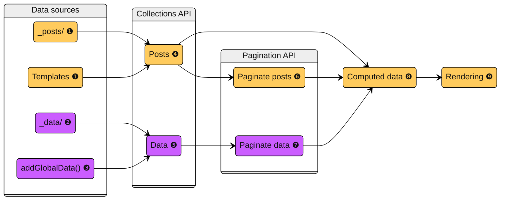

As the title says, this blog is now generated with [Eleventy](https://www.11ty.dev/), or 11ty as they call it. I thought I would write a little bit about my experience translating this blog, which comes from a static Wordpress, from Jekyll to 11ty.

I have _opinions_, so skip what doesn't interest you:

[[toc]]

## In the beginning was Wordpress

I keep saying that [static web sites are the best](ee3a1b4d-092e-459d-82eb-f9d25038f4a3). The modern web feels bloated and unnecessarily wasteful to me, maybe I'm getting old. Static web sites are [a better web](7aba63cf-f969-404f-bdcc-82c702abc24a): content-centric, fast, easy to deploy and cheap to maintain.

I started this attempt to a personal blog many years ago with Wordpress, with the 8-bit theme from [Brutalist Themes](https://brutalistthemes.com/) (which came with a GPL license!). Then I adapted the [WP2Static plugin](https://github.com/elementor/wp2static) so it would generate a static website, using Wordpress as a kind of WYSIWYG web editor. It was a fun project but very difficult to maintain, and at some point I lost the instance that stored the Wordpress setup.

## Jekyll is great, but...

Some years ago I reconstructed the web site from Internet Archive snapshots, but this time using Jekyll. Why did I choose Jekyll? Well, it was the Wordpress of static web sites. I imagine GitHub choosing it for their Pages made it explode in popularity. I must say that for simple things it "just works": you put your posts in `./_posts`, add some HTML templates with Liquid syntax, and that's it.

It served me well, and as a programmer it gave me the flexibility to implement my own plugins to do fun stuff: decorate external links, tables of content, etc. Was it _necessary_ to reimplement that? No. Was it because there weren't plugins available? Again, no. But was it fun? Yes! And that is the whole point of having my own blog, doing _unnecessary_ and funny things.

Obviously there is a "but" at the end of the previous paragraph, because Jekyll had its shortcomings.

For starters, the decision to implement Jekyll in Ruby. I liked learning a little bit of Ruby, but the tooling felt clunky, at least for a simple blog. I never got used to gems and `rvm`, it felt very difficult to set up. Another pain point was the performance, which isn't a big problem for a small blog, but it seemed unnecessarily low nevertheless. In addition, Jekyll rapidly feels rigid and verbose if you have to slightly deviate from the expected functionality. It may not be alone in this, more below.

Another reason is the status of the project. Every time I visited the GitHub page of a plugin, the last commit was 5 years old or more. This is subjective, and Jekyll could instead be thriving, but it gave me the impression like it was slowly dying.

It is at this point when I heard about Eleventy...

## Hi, my friends call me 11ty

I started following [11ty's Mastodon](https://hachyderm.io/@eleventy@fosstodon.org) account and seemed an interesting project. And, as an engineer, I cannot resist the temptation of a big, unnecessary refactor and "just rewrite it in ~~Rust~~ 11ty".

Jekyll users will feel using 11ty very natural: the `_posts` or `_includes` directories, rendering the static files to a `_site` directory, support for Markdown and Liquid, and so on.

I also count 11ty's tooling as an improvement. And by that I mean NodeJS tooling. `npm` and `package.json` felt like an improvement. And, in general, the Javascript community is _huge_, so 11ty has access to so many more packages.

Before going on to more details: both Jekyll and 11ty have great documentation sites, well written and with many examples. My only complain about [11ty's documentation site](https://www.11ty.dev/docs/) is that the division in chapters only made sense _after_ I understood the basic concepts of 11ty. Also, the search function is not great (try searching for `setLayoutsDirectory`), but I guess that's what happens with static sites. It was easy to get lost, to the point that I wrote a Python script to scrape the documentation web site and store it as a PDF, which then I fed to a NotebookLM project.

There is no official guide to migrate from Jekyll to 11ty, so this is the general plan:

1. Translate your [`_config.yml`](https://jekyllrb.com/docs/configuration/) to [`eleventy.config.js`](https://www.11ty.dev/docs/config-shapes/#callback-function).
2. You can keep your posts in `_posts` and your layouts in `_includes`. By default 11ty doesn't distinguish between layouts and includes, if you use the `_layouts` directory you'll need to turn on [`setLayoutsDirectory()`](https://www.11ty.dev/docs/config/#directory-for-layouts-optional) in the configuration.
3. While using [``](https://jekyllrb.com/docs/includes/) to compose templates is a common practice in Jekyll, in 11ty it depends on which render engine you are using, and in general you lose the `page` context. I had to slightly modify my template structure and use LiquidJS [``](https://liquidjs.com/api/classes/Liquid.html#renderFile) with the explicit state that it required.
4. 11ty supports many template engines, beyond Markdown and Liquid. In particular 11ty's [native Javascript templates](https://www.11ty.dev/docs/languages/javascript/) and [global data files](https://www.11ty.dev/docs/data-global/) are a powerful tool. Beware: 11ty's Liquid flavor is slightly different than Jekyll's, so it will need some massaging. For instance, 11ty doesn't support `markdownify`.
5. The overall data flow used by 11ty is similar to Jekyll: posts with a front matter get rendered by templates, which can be composed with layouts and includes. However, while Jekyll has [`pages`](https://jekyllrb.com/docs/pages/) and [`posts`](https://jekyllrb.com/docs/posts/), in 11ty everything is just [`data`](https://www.11ty.dev/docs/data/) which can be grouped within a [`collection`](https://www.11ty.dev/docs/collections/). I think this is a natural evolution, but the posts/pages organization will be more familiar to people coming from Wordpress.
6. Adding [custom filters](https://www.11ty.dev/docs/filters/) or [shortcodes](https://www.11ty.dev/docs/shortcodes/) is as easy, if not more, as [in Jekyll](https://jekyllrb.com/docs/plugins/filters/).

If you only have a bunch of loose Markdown files in a `_posts` directory, with some templates to render them, that's more or less it. But anything more complex starts getting more challenging.

## What the hell is a pagination? Understading 11ty's data flow

Personally, it took me a long time to understand the [data flow process](https://www.11ty.dev/docs/advanced-order/) within 11ty, and I still struggle. This is my mental model:



The data items can be sourced from files ❶ (for instance the `_posts` directory, or the `index.html` page), from data files ❷ ([like Jekyll](https://jekyllrb.com/docs/datafiles/), 11ty will fetch [global data files](https://www.11ty.dev/docs/data-global/) from `_data` or from [local data files](https://www.11ty.dev/docs/data-template-dir/)) or generated programmatically ❸ (for instance using [`addGlobalData()`](https://www.11ty.dev/docs/data-global-custom/)).

These items/posts/pages can be added to collections using the [collections API](https://www.11ty.dev/docs/collections/) ❹❺. Collections are accessible in the templates with the handy `collections` object.

Then, there's [`pagination`](https://www.11ty.dev/docs/pagination/) ❻❼. I really struggled with this, because it conflates several functionalities in a single mechanism, but it [boils down](https://www.11ty.dev/docs/pages-from-data/) to:

> The Pagination feature is used for iterating over any data to create multiple output files.

A better way to describe it, in my opinion, would be: Pagination renders _m_ data items onto _n_ HTML pages.

For instance:

* _m_ data items in 1 page: an archive or home page.
* _m_ data items in _m / k_ pages: an archive _k_ items per page.
* _m_ data items in _m_ pages: render a collection of posts, each one in an independent page.

But there's something more to the `pagination` mechanism. The data items coming from pages and templates ❶ are `page` objects ready to be rendered, while data items ❷❸ [need](https://www.11ty.dev/docs/pages-from-data/) to be transformed ❼. This is not just a methaphor. Even if they share some pipeline stages, like the collections or pagination APIs, they are different kinds of objects and somehow 11ty knows this.

For example, the data items coming from posts or templates ❶ will come with a front matter and several other properties, which are accessible in the early stages, like the collections API ❹. This means that front matter properties of a post can be accessed and modified, and that will be propagated to the `page.data` object when rendering it ❾.

That is not the case with a raw data item ❷❸. Modifications to the data item ❺ will not be propagated automatically when it is processed by a pagination ❼. Technically, `pagination` allows to specify the front matter properties of the page that will be rendered from a data item. _However,_ only `permalink` can access the data item. Yes: no other front matter properties can access the data item.

Then, how to make properties of a data item available to the templates? In other words, how to go from this:

```JSON
{
  "title": "A Tale of Two Cities",
  "lang": "English",
  "excerpt": "It was the best of times, it was the worst of times."
}
```

To this:

```
---
title: A Tale of Two Cities
permalink: /en/a-tale-of-two-cities/
---

It was the best of times, it was the worst of times.
```

As the documentation [says](https://www.11ty.dev/docs/data-frontmatter/):

> Note that only the `permalink` and `eleventyComputed` front matter values can contain variables and shortcodes like you would use in the body of your templates. If you need to use variables or shortcodes in other front matter values, use `eleventyComputed` to set them.

This is where [`computed data`](https://www.11ty.dev/docs/data-computed/) ❽ comes into play, which is a stage between pagination and rendering, and allows to specify front matter properties calculated from the original data item.

## Extensibility, extensibility everywhere

When the basic template structure of the web site was done, I needed to port my custom plugins. 11ty comes with some fancy plugins that are drop-in replacements, but what I liked the most is the use of Markdown-it, which has many nice plugins itself and makes it easy to add your own. 11ty helps with this through [`amendLibrary()`](https://www.11ty.dev/docs/languages/markdown/#optional-amend-the-library-instance).

This is how I could add [tables of content](https://github.com/cmaas/markdown-it-table-of-contents) or [footnotes](https://github.com/markdown-it/markdown-it-footnote). For other stuff, like my own plugin that optimizes image sizes or the [static full text search](ee3a1b4d-092e-459d-82eb-f9d25038f4a3), it was quite fast to implement in Javascript.

If implementing my own plugin provided a little extra and wasn't incredibly difficult, I avoided the official ones. This allowed me to experiment with most of 11ty's features. I think the only functionality I didn't touch were the [preprocessors](https://www.11ty.dev/docs/config-preprocessors/) and [transforms](https://www.11ty.dev/docs/transforms/). Maybe I will revisit my custom plugins, as I still have to check the many [official plugins](https://www.11ty.dev/docs/plugins/official/).

## Would buy again

So, overall, the whole experience has been positive, and I feel like Javascript is a much better language to do this kind of rapid development, especially when it is also used in the rendered page. On the cons side, I still feel like Jekyll and 11ty are designed to be very easy to use for simple use cases at the cost of being difficult to extend sometimes. While 11ty makes it easier to generate pages programmatically using pagination, accessing the existing data can be almost impossible in some parts of the flow.

Sometimes, the data flow can be difficult to understand. Why only `permalink` can be computed from data items, while other fields require `computed data`? Why I global data and collections can be accessed in some places, while not in others? This issues are not unique to 11ty, and Jekyll also suffers from it. Most likely there are good reasons for these design decisions, but to a foreign observer (with too much time and refusing to use the official plugins) it can be puzzling.

Anyway, it has been a fun project and I think 11ty makes developing your own static blog a nice experience.
