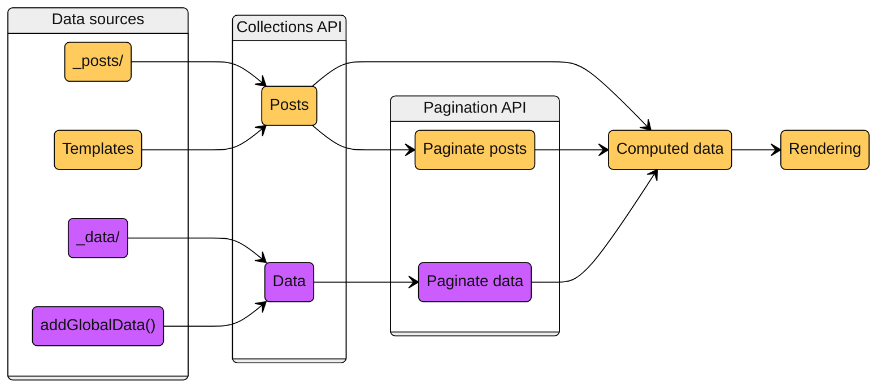

As the title says, this blog is now generated with [Eleventy](https://www.11ty.dev/), or 11ty as they call it. I thought I would write a little bit about my experience translating this blog, which comes from a static Wordpress, from Jekyll to 11ty.

I have _opinions_, so use this table of contents to skip what doesn't interest you:

[[toc]]

## In the beginning was Wordpress

I keep saying that [static web sites are the best](ee3a1b4d-092e-459d-82eb-f9d25038f4a3). The modern web feels bloated and unnecessarily wasteful to me, maybe I'm getting old. To me, static web sites are [a better web](7aba63cf-f969-404f-bdcc-82c702abc24a): content-centric, fast, easy to deploy and cheap to maintain.

I started this attempt to a personal blog many years ago with Wordpress, with the 8-bit theme from [Brutalist Themes](https://brutalistthemes.com/) (which came with a GPL license!). Then I adapted the [WP2Static plugin](https://github.com/elementor/wp2static) so it would generate a static website, using Wordpress as a kind of WYSIWYG web editor. It was a fun project but very difficult to maintain, and at some point I lost the instance that stored the Wordpress setup.

## Jekyll is great, but...

Some years ago I reconstructed the web site from Internet Archive snapshots, but this time using Jekyll. Why did I choose Jekyll? Well, it was the Wordpress of static web sites. I imagine GitHub choosing it for their Pages made it explode in popularity. I must say that for simple things it "just works": you put your posts in `./_posts`, add some templates with Liquid syntax, and that's it. That's your static web site.

It served me well, and as a programmer it gave me the flexibility to implement my own plugins to do fun stuff: decorate external links, tables of content, etc. Was it _necessary_ to reimplement that? No. Was it because there weren't plugins available? Again, no. But was it fun? Yes! And that is the whole point of having my own blog, doing _unnecessary_ and funny things.

Obviously there is a "but" at the end of the previous paragraph, because Jekyll had its shortcomings.

For starters, I am not a fan of Ruby. I mean, I like the language, I get why the community loves its ergonomics, and it was nice to learn it. But the tooling still feels clunky, at least for a simple blog. I never got used to gems and `rvm`, it felt very difficult to set up. Another pain point was the performance, which isn't a big problem in a small blog but seemed unnecessarily slow. In addition, Jekyll rapidly feels rigid and verbose if you have to slightly deviate from the expected functionality. Jekyll may not be alone in this, more below.

A third motive is the status of the project. Every time I visited the GitHub page of a plugin, the last commit was 5 years old or more. This is subjective, and Jekyll could instead be thriving, but it gave me the impression like it was slowly dying.

It is at this point when I heard about Eleventy...

## Hi, my friends call me 11ty

I started following [11ty's Mastodon](https://hachyderm.io/@eleventy@fosstodon.org) account, and as an engineer I cannot resist the temptation of a big, unnecessary refactor and "just rewrite it ~~Rust~~ 11ty".

Jekyll users will feel using 11ty very natural, as it reuses many of its design choices: the `_posts` or `_includes` directories, rendering the static files to a `_site` directory, support for Markdown and Liquid, and so on. So far, so good.

I also count 11ty's tooling as an improvement. It is based on NodeJS, so `npm` and `package.json` felt much easier to use than gems and `rvm`. And, in general, the Javascript community is _huge_, so it means access to so many more packages.

Before going on to more details: both Jekyll and 11ty have great documentation sites, well written and with many examples. My only complain about 11ty's documentation site is that the structure is a bit random and the search function is not great (try searching for `setLayoutsDirectory`). For instance, when rendering a template you obtain a `page` object with everything you'll need. That is explained in the "Eleventy Supplied Data" page, under the "Using Data" section. It was easy to get lost, to the point that I wrote a Python script to scrape the documentation web site and store it as a PDF, which then I fed to a NotebookLM project.

The general steps to migrate from Jekyll to 11ty would be:

1. Translate your [`_config.yml`](https://jekyllrb.com/docs/configuration/) to [`eleventy.config.js`](https://www.11ty.dev/docs/config-shapes/#callback-function).
2. You can keep your posts in `_posts` and your layouts in `_includes`. By default 11ty doesn't distinguish between layouts and includes, if you use the `_layouts` directory you'll need to turn on [`setLayoutsDirectory()`](https://www.11ty.dev/docs/config/#directory-for-layouts-optional) in the configuration.
3. While [``](https://jekyllrb.com/docs/includes/) is very usual in Jekyll, in 11ty it depends on which render engine you are using, and in general you lose the page context. I had to slightly modify my template structure and use LiquidJS [``](https://liquidjs.com/api/classes/Liquid.html#renderFile) with the explicit state that it required.
4. 11ty supports many template engines, beyond Markdown and Liquid. There's also Nunchucks and Handlebars, or pure Javascript or even Typescript, among many others. Beware: 11ty's Liquid flavor is slightly different than Jekyll's, so it will need some massaging. For instance, 11ty doesn't support `markdownify`.
5. The data cascade used by 11ty is similar to Jekyll in general: posts with front matter get rendered by templates, which can be composed with layouts. However, while Jekyll has [`pages`](https://jekyllrb.com/docs/pages/) and [`posts`](https://jekyllrb.com/docs/posts/), in 11ty everything is just [`data`](https://www.11ty.dev/docs/data/) which can be grouped within a [`collection`](https://www.11ty.dev/docs/collections/).

## What the hell is a pagination?

If you only have a bunch of loose Markdown files in a `_posts` directory, with some templates to render them, that's more or less it. But anything more complex starts getting more difficult.

Personally, it took me a long time to understand the data flow process within 11ty, and I still struggle. The data items can be sourced from files (for instance the `_posts` directory, or the `index.html` page), from data files ([like Jekyll](https://jekyllrb.com/docs/datafiles/), 11ty will fetch [data files](https://www.11ty.dev/docs/data-global/) from `_data`) or generated programmatically (for instance using [`addGlobalData`](https://www.11ty.dev/docs/data-global-custom/)). But these data sources are not created equally: posts from files become page objects ready to be rendered, while data [needs](https://www.11ty.dev/docs/pages-from-data/) to be transformed into a page using something called [`pagination`](https://www.11ty.dev/docs/pagination/). Which, as it name implies, also allows to group posts in a single page. In my opinion, conflating web pagination with the conversion of data items into page objects was not the best design decision, but whatever.

It took me a while to understand that _data items are not page objects_. Even if they share some pipeline stages, like the collections or pagination APIs, they are different kinds of objects and somehow 11ty knows this. This is important because only page objects can be rendered by a template.

This is how I picture the whole [data flow process](https://www.11ty.dev/docs/advanced-order/):

Data coming from post files is immediately available as a post object (yellow), while data items (purple) items need to go through a pagination to be rendered as pages. Alternatively, I may have understood the whole thing wrong and the above graph will make 11ty developers frown.

At any rate, understanding the previous flow is important. For instance, post objects have a front matter which, _and this is important,_ is immediately accessible in early stages, like the collections API. This means that front matter properties of a post can be accessed and modified, and that will be propagated to the `page.data` object when rendering it.

That is not the case with a raw data item. If a new property is added in early stages (when it is still a purple box), it will not be propagated automatically when it is rendered by a pagination. Then, how to make properties of a data item available to the templates? Through [`computed data`](https://www.11ty.dev/docs/data-computed/), which is a stage between pagination and rendering, and makes front matter properties available.

## Extensibility, extensibility everywhere

When the basic template structure of the web site was done, I needed to port my many custom plugins that provide support for localization or rendering fancy Mermaid diagrams as inlined SVG code. 11ty comes with some fancy plugins that are drop-in replacements, but what I liked the most is the use of Markdown-it, which has many nice plugins itself and makes it easy to add your own.

This is how I could add [tables of content](https://github.com/cmaas/markdown-it-table-of-contents) or [footnotes](https://github.com/markdown-it/markdown-it-footnote). For other stuff, like my own plugin that optimizes image sizes or the [static full text search](ee3a1b4d-092e-459d-82eb-f9d25038f4a3), it was quite fast to implement in Javascript.

If implementing my own plugin provided a little extra and wasn't incredibly difficult, I avoided the existing plugins. This allowed me to experiment with most of 11ty's features. I think the only functionality I didn't touch were the [preprocessors](https://www.11ty.dev/docs/config-preprocessors/) and [transforms](https://www.11ty.dev/docs/transforms/). Maybe I will revisit this, as I still have to check the many [official plugins](https://www.11ty.dev/docs/plugins/official/).

## Would buy again

So, overall, the whole experience has been positive, and I feel like Javascript is a much better language to do this kind of rapid development, especially when it is also used in the rendered page. On the cons side, I still feel like Jekyll and 11ty are designed to be very easy to use for simple use cases at the cost of being difficult to extend sometimes. While 11ty makes it easier to generate pages programmatically using pagination, but accessing the existing data can be almost impossible in some parts of the flow.

For instance, I wanted to extend the Markdown engine and that required having access to global data or existing collections. This proved to be difficult, and required some hacks like having a global shared variable. Maybe there is another way to do it, and I'm just holding it from the wrong end.

Anyway, it has been a fun project and I think 11ty makes developing your own static blog a nice experience.
